# Bruno CLI Multi-Collection GitHub Actions Example

This repository demonstrates **the key pattern for running multiple Bruno API collections in a single GitHub Actions workflow**. The main focus is showing how to structure your workflow file to test multiple collections in parallel using GitHub Actions matrix strategy.

## 🎯 The Core Problem This Solves

When you have multiple Bruno collections in your repository, you want to:
- ✅ Run all collections automatically in CI/CD
- ✅ Test each collection with its appropriate environment
- ✅ Run collections in parallel for faster feedback
- ✅ Get separate test reports for each collection
- ✅ Have the workflow fail only if tests actually fail (not setup issues)

## 🔑 The Key GitHub Actions Pattern

The magic happens in the **matrix strategy** in `.github/workflows/CI-Bru-Cli-Demo.yml`. Here's the core pattern:

```yaml
strategy:
  matrix:
    include:
      - collection: github-rest-api-collection
        env: Github
      - collection: cat-facts-api-collection
        env: catfacts - prod
      - collection: bruno-echo-api-collection
        env: Local-Env
  fail-fast: false
```

**This creates 3 parallel jobs**, each running a different collection with its specific environment.

## 📋 Step-by-Step Workflow Breakdown

### 1. Matrix Strategy Setup

The workflow uses GitHub Actions matrix strategy to create multiple parallel jobs:

```yaml
# Each include creates one job
strategy:
  matrix:
    include:
      - collection: your-collection-folder-name
        env: your-environment-name-from-bru-file
  fail-fast: false  # Don't stop other jobs if one fails
```

**Key Points:**
- `collection`: Must match the folder name in `bruno-collections/`
- `env`: Must match the environment file name (without `.bru` extension)
- `fail-fast: false`: Ensures all collections run even if one fails

### 2. Dynamic Working Directory

Each job runs in the specific collection directory:

```yaml
- name: Run API Tests
  working-directory: ./bruno-collections/${{ matrix.collection }}
  run: bru run --env "${{ matrix.env }}" --reporter-html results.html
```

**Why this works:**
- Bruno CLI looks for `bruno.json` in the current directory
- Environment files are loaded from `./environments/` relative to working directory
- Each collection is completely isolated

### 3. Parallel Execution with Unique Artifacts

Each job uploads its own test results:

```yaml
- name: Upload Test Results
  uses: actions/upload-artifact@v4
  with:
    name: test-results-${{ matrix.collection }}-${{ matrix.env }}
    path: bruno-collections/${{ matrix.collection }}/results.html
```

**Result:** You get separate downloadable reports for each collection.

## 🏗️ Repository Structure (Required Pattern)

For this workflow pattern to work, your repository must follow this structure:

```
your-repo/
├── .github/workflows/
│   └── CI-Bru-Cli-Demo.yml      # The workflow file
├── bruno-collections/            # All collections go here
│   ├── collection-1/
│   │   ├── bruno.json           # Required: Collection config
│   │   ├── environments/        # Required: Environment folder
│   │   │   ├── env1.bru        # Environment files
│   │   │   └── env2.bru
│   │   └── *.bru               # Your API requests
│   ├── collection-2/
│   │   ├── bruno.json
│   │   ├── environments/
│   │   │   └── prod.bru
│   │   └── *.bru
│   └── collection-3/
│       ├── bruno.json
│       ├── environments/
│       │   └── staging.bru
│       └── *.bru
└── README.md
```

**Critical Requirements:**
- Each collection must have its own folder under `bruno-collections/`
- Each collection must have a `bruno.json` file
- Each collection must have an `environments/` folder with `.bru` environment files
- Environment names in the workflow must match the `.bru` file names (without extension)

## � How to Implement This Pattern in Your Repository

### Step 1: Copy the Workflow File

Copy `.github/workflows/CI-Bru-Cli-Demo.yml` to your repository and modify the matrix:

```yaml
strategy:
  matrix:
    include:
      # Replace these with your actual collections and environments
      - collection: your-api-collection
        env: production
      - collection: your-auth-collection
        env: staging
      - collection: your-integration-collection
        env: local
  fail-fast: false
```

### Step 2: Organize Your Collections

Move your Bruno collections into the `bruno-collections/` folder structure:

```bash
# Before (typical Bruno setup)
my-api-tests/
├── bruno.json
├── environments/
└── requests/

# After (multi-collection setup)
bruno-collections/
└── my-api-tests/
    ├── bruno.json
    ├── environments/
    └── requests/
```

### Step 3: Update the Matrix

For each collection, add a matrix entry:

```yaml
- collection: folder-name-in-bruno-collections
  env: environment-file-name-without-bru-extension
```

### Step 4: Test Locally First

Before pushing, test each collection locally:

```bash
cd bruno-collections/your-collection-name
bru run --env "your-environment-name" --reporter-html results.html
```

## 💡 Real Example from This Repository

Here's how the three collections in this repo are configured:

| Collection Folder | Environment File | Matrix Entry |
|------------------|------------------|--------------|
| `github-rest-api-collection` | `environments/Github.bru` | `collection: github-rest-api-collection`<br>`env: Github` |
| `cat-facts-api-collection` | `environments/catfacts - prod.bru` | `collection: cat-facts-api-collection`<br>`env: catfacts - prod` |
| `bruno-echo-api-collection` | `environments/Local-Env.bru` | `collection: bruno-echo-api-collection`<br>`env: Local-Env` |

**Notice:** The `env` value matches the environment file name exactly (spaces and all), but without the `.bru` extension.

## ⚠️ Common Pitfalls and Solutions

### 1. Environment Name Mismatch
**Problem:** Workflow fails with "Environment not found"
```
Error: Environment 'production' not found
```

**Solution:** Check that your matrix `env` value exactly matches your `.bru` file name:
```yaml
# If your file is environments/production-api.bru
- collection: my-collection
  env: production-api  # Must match exactly (no .bru extension)
```

### 2. Wrong Working Directory
**Problem:** Bruno CLI can't find `bruno.json`
```
Error: bruno.json not found
```

**Solution:** Ensure your `working-directory` points to the collection folder:
```yaml
working-directory: ./bruno-collections/${{ matrix.collection }}
```

### 3. Collection Folder Name Mismatch
**Problem:** Directory not found error
```
Error: ./bruno-collections/my-api-tests: No such file or directory
```

**Solution:** Matrix `collection` value must match the actual folder name exactly:
```yaml
# If your folder is bruno-collections/my-api-tests/
- collection: my-api-tests  # Must match folder name exactly
```

## 🎯 Workflow Execution Flow

Here's what happens when you push code:

```mermaid
graph TD
    A[Push to main] --> B[GitHub Actions triggered]
    B --> C[Matrix creates 3 parallel jobs]
    C --> D[Job 1: github-rest-api-collection]
    C --> E[Job 2: cat-facts-api-collection]
    C --> F[Job 3: bruno-echo-api-collection]

    D --> G[Setup Node.js]
    E --> H[Setup Node.js]
    F --> I[Setup Node.js]

    G --> J[Install Bruno CLI]
    H --> K[Install Bruno CLI]
    I --> L[Install Bruno CLI]

    J --> M[Run tests with Github env]
    K --> N[Run tests with catfacts-prod env]
    L --> O[Run tests with Local-Env env]

    M --> P[Upload results artifact]
    N --> Q[Upload results artifact]
    O --> R[Upload results artifact]

    P --> S[✅ Complete]
    Q --> S
    R --> S
```



## 📊 Viewing Test Results

After the workflow completes:

1. **Go to Actions tab** in your GitHub repository
2. **Click on the latest workflow run**
3. **Scroll down to "Artifacts" section**
4. **Download individual reports**:
   - `test-results-github-rest-api-collection-Github`
   - `test-results-cat-facts-api-collection-catfacts - prod`
   - `test-results-bruno-echo-api-collection-Local-Env`

Each artifact contains an HTML file with detailed test results, request/response data, and assertion outcomes.

## � Quick Start for Your Repository

### 1. Copy This Pattern

```bash
# 1. Copy the workflow file
mkdir -p .github/workflows
cp .github/workflows/CI-Bru-Cli-Demo.yml .github/workflows/

# 2. Create the collections structure
mkdir -p bruno-collections

# 3. Move your existing Bruno collections
mv your-existing-collection bruno-collections/
```

### 2. Update the Matrix

Edit `.github/workflows/CI-Bru-Cli-Demo.yml`:

```yaml
strategy:
  matrix:
    include:
      # Add one entry per collection
      - collection: your-collection-folder-name
        env: your-environment-name
        description: "Description for logs"
```

### 3. Test and Deploy

```bash
# Test locally first
cd bruno-collections/your-collection
bru run --env "your-environment" --reporter-html results.html

# Commit and push
git add .
git commit -m "Add multi-collection Bruno workflow"
git push
```

## 🔧 Advanced Configurations

### Running Different Collections on Different Triggers

```yaml
# Run only specific collections on PR
on:
  pull_request:
    branches: [ "main" ]

strategy:
  matrix:
    include:
      - collection: smoke-tests
        env: staging
      # Skip heavy integration tests on PR

# Run all collections on main branch
on:
  push:
    branches: [ "main" ]

strategy:
  matrix:
    include:
      - collection: smoke-tests
        env: production
      - collection: integration-tests
        env: production
      - collection: performance-tests
        env: production
```

### Adding Secrets for Authentication

```yaml
# In your workflow file
- name: Run API Tests
  working-directory: ./bruno-collections/${{ matrix.collection }}
  env:
    API_KEY: ${{ secrets.API_KEY }}
    AUTH_TOKEN: ${{ secrets.AUTH_TOKEN }}
  run: bru run --env "${{ matrix.env }}" --reporter-html results.html
```

Then reference in your Bruno environment files:
```javascript
// In environments/production.bru
vars {
  baseUrl: https://api.production.com
  apiKey: {{process.env.API_KEY}}
}
```

## 📚 Learn More

- [Bruno Documentation](https://docs.usebruno.com/)
- [Bruno CLI Documentation](https://docs.usebruno.com/cli/overview)
- [GitHub Actions Matrix Strategy](https://docs.github.com/en/actions/using-jobs/using-a-matrix-for-your-jobs)
- [GitHub Actions Secrets](https://docs.github.com/en/actions/security-guides/encrypted-secrets)

## 🤝 Contributing

This repository serves as a reference implementation. Feel free to:
- Fork and adapt for your use case
- Submit issues for clarification
- Suggest improvements to the workflow pattern
- Add more example collections

---

**🎯 The goal: Make it easy for anyone to run multiple Bruno collections in GitHub Actions!**
